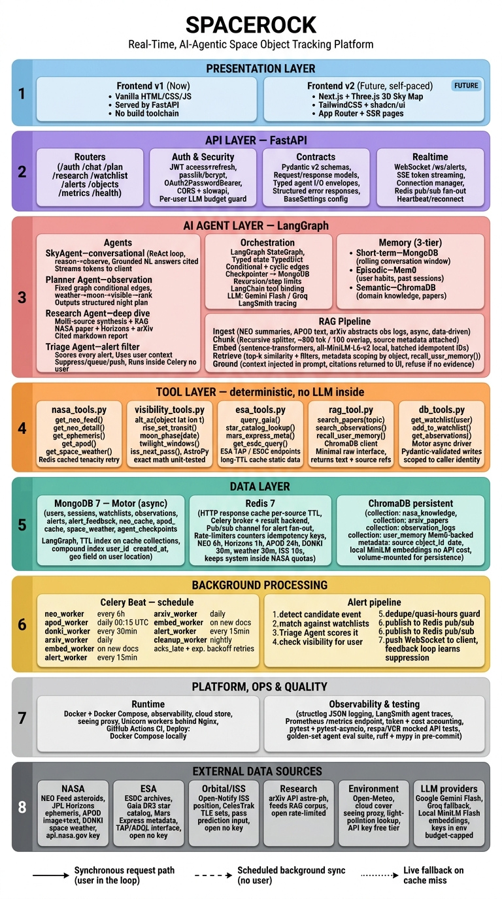

<div align="center">

# 🪨 SpaceRock

**Real-Time, AI-Agentic Space Object Tracking Platform**

[](https://python.org)
[](https://fastapi.tiangolo.com)
[](https://langchain-ai.github.io/langgraph)
[](LICENSE)
[](https://github.com)

*Ask in plain English. Get grounded, cited answers backed by live NASA data.*

</div>

---

## What Is This?

SpaceRock is a personal project I am building as a deep-dive into agentic AI engineering. It tracks near-Earth objects, ISS passes, solar weather events, and astronomical visibility — then answers questions about them through a multi-agent AI layer grounded in real data.

**Key design principle:** every number in every answer traces to a live NASA/ESA endpoint or a deterministic AstroPy calculation. The LLM is never asked to compute an orbit or invent an altitude. It earns its place at tool selection, synthesis, and triage — nowhere else.

---

## Demo

```
User:   Is Apophis going to be visible from New Delhi next Friday?

SkyAgent: Yes. Apophis (99942) reaches opposition on [date]. From New Delhi
          (28.6°N, 77.2°E), it rises at 21:14 IST, peaks at 42.3° altitude
          at 01:07 IST, and sets at 05:22 IST. Moon phase: 12% waning crescent
          — negligible interference. Magnitude: 8.4, binocular threshold.
          
          Sources: JPL Horizons ephemeris · AstroPy rise/set · Open-Meteo forecast
```

---

## Architecture

<div align="center">

</div>

The system has **8 layers** with strict one-way dependencies:

| # | Layer | Tech |
|---|---|---|
| 1 | **Presentation** | Vanilla HTML/CSS/JS (v1) → Next.js + Three.js (v2, future) |
| 2 | **API** | FastAPI · JWT · Pydantic v2 · WebSocket + SSE |
| 3 | **AI Agents** | LangGraph · 4 agents · 3-tier memory · RAG pipeline |
| 4 | **Tools** | Pure deterministic functions — no LLM inside |
| 5 | **Data** | MongoDB 7 · Redis 7 · ChromaDB |
| 6 | **Background** | Celery Beat + workers · alert pipeline |
| 7 | **Ops** | Docker Compose · GitHub Actions · Langfuse · ruff/mypy |
| 8 | **External** | NASA · ESA · CelesTrak · arXiv · Open-Meteo · Gemini/Groq |

---

## Agents

### SkyAgent — Conversational
ReAct loop. Answers open-ended questions about any space object. Every numeric claim is sourced from a tool result. Streams citations to the UI. Refuses to answer numerically if the relevant tool call failed.

### Planner Agent — Observation Planner
Genuine multi-node LangGraph graph with conditional edges:
```
fetch_weather → fetch_moon_phase → query_visible_objects
    → [if all nights clouded → degraded plan]
    → rank_by_llm → assemble_nightly_plan
```
Everything upstream of the ranking node is deterministic. Output: a typed `NightPlan` Pydantic model.

### Research Agent — Deep Dive
Fan-out retrieval across arXiv, NASA papers, and JPL Horizons. Synthesises into a cited Markdown report. Every factual claim traces to a retrieved chunk. Unsupported claims are dropped, not softened.

### Triage Agent — Alert Filter
Celery-invoked. No user in the loop. Scores every NEO/DONKI event against every watchlist. Decides `suppress` / `queue for digest` / `push now`. Learns suppression preferences via episodic memory over time.

---

## Memory — 3 Tiers

| Tier | Store | What It Holds |
|---|---|---|
| Short-term | MongoDB session doc | Rolling conversation window |
| Episodic | mem0 (self-hosted) | Past interactions, user preferences, suppression history |
| Semantic | ChromaDB | Domain knowledge, research corpus, observation logs |

---

## RAG Pipeline

```
Ingest (NASA/arXiv)
  → Chunk (~800 tok / 100 overlap, source metadata attached)
  → Embed (all-MiniLM-L6-v2, fully local, no API cost)
  → Store (ChromaDB, per-corpus collections with object_id + date filters)
  → Retrieve (top-k similarity + metadata scoping)
  → Ground (citations injected into prompt, returned to UI)
```

If nothing relevant is retrieved, the agent says so. It never falls back to parametric knowledge for factual claims.

---

## Tools — Deterministic, No LLM Inside

Every tool is a pure, typed function. Unit-testable against fixed expected values.

| File | Functions |
|---|---|
| `nasa_tools.py` | `get_neo_feed()` · `get_neo_detail()` · `get_ephemeris()` · `get_apod()` · `get_space_weather()` |
| `visibility_tools.py` | `alt_az()` · `rise_set_transit()` · `moon_phase()` · `twilight_windows()` · `iss_next_pass()` |
| `esa_tools.py` | `query_gaia()` · `star_catalog_lookup()` · `mars_express_meta()` · `get_esdc_query()` |
| `rag_tool.py` | `search_papers()` · `search_observations()` · `recall_user_memory()` |
| `db_tools.py` | `get_watchlist()` · `add_to_watchlist()` · `get_observations()` · `get_alert_history()` |

`visibility_tools.py` uses AstroPy + Skyfield for exact trigonometry. An LLM is never asked to approximate an angle.

---

## Tech Stack — 100% Free

| Need | Choice |
|---|---|
| LLM (primary) | Google Gemini Flash via AI Studio (free key) |
| LLM (fallback) | Groq free tier → Ollama local |
| Embeddings | `sentence-transformers/all-MiniLM-L6-v2` — fully local |
| Agent orchestration | LangGraph + LangChain |
| Episodic memory | mem0ai open-source (self-hosted, never the Mem0 platform) |
| Vector DB | ChromaDB, persistent local volume |
| Structured DB | MongoDB 7 via Motor (async) |
| Cache + broker | Redis 7 |
| Background jobs | Celery + Celery Beat |
| Observability | Langfuse (self-hosted Docker) |
| CI | GitHub Actions |

---

## Quick Start

**Requirements:** Docker + Docker Compose, a [NASA API key](https://api.nasa.gov/) (free), a [Google AI Studio key](https://aistudio.google.com) (free).

```bash
git clone https://github.com/insomniac1712/SpaceRock
cd SpaceRock

# Copy and fill in your free API keys
cp .env.example .env

# Start everything
docker compose up
```

Then open `http://localhost:8000`.

---

## Build Phases

| Phase | What It Delivers | Status |
|---|---|---|
| 0 · Foundation | FastAPI · DB connections · all tools tested · AstroPy verified | 🔲 |
| 1 · RAG | Chroma ingesting + retriever returning cited chunks | 🔲 |
| 2 · SkyAgent | First agent live end-to-end through the API | 🔲 |
| 3 · Graph Agents | Planner (conditional LangGraph) + Research Agent | 🔲 |
| 4 · Background | Celery workers + WebSocket alerts + Triage | 🔲 |
| 5 · Memory | mem0 episodic layer wired into agents | 🔲 |
| 6 · Frontend v1 | Vanilla HTML/CSS/JS — chat, dashboard, watchlist, alerts | 🔲 |
| 6+ · Frontend v2 | Three.js sky map + Next.js *(self-paced, after v1)* | ⏳ |

---

## Architectural Rules

These are non-negotiable. Any shortcut that violates one is a bug, not a feature.

1. **One-way layer dependencies.** Frontend never calls NASA. Agents never call the frontend. Tools never reason.
2. **No LLM inside a tool.** Every tool is deterministic — testable against fixed values.
3. **Reads hit the local synced copy.** Live external calls are cache-miss fallback only.
4. **API layer holds no domain logic.** Validate, authenticate, route, stream — nothing else.
5. **Pipelines are independent.** Background sync runs whether or not a user is online.
6. **AstroPy for angles, always.** Alt-az, rise/set, moon phase — exact trigonometry, never an LLM approximation.

---

## Evaluation Targets

| Metric | Target |
|---|---|
| Tool correctness | Unit tests vs. published astronomical values |
| Groundedness | 30-question golden set — every numeric claim traceable |
| Retrieval | Precision@5 on a hand-labelled evaluation set |
| Alert precision | Before vs. after episodic memory |
| Latency | p50 < 500ms (cached reads) · p95 < 3s to first streamed token |
| Reproducibility | `git clone` → `docker compose up` → passing CI |

---

## Project Structure

```
spacerock/
├── main.py                  # FastAPI entry point
├── core/                    # config, database, security, logging
├── agents/                  # sky, planner, research, triage agents + prompts + state
├── tools/                   # nasa, esa, visibility, rag, db tools
├── rag/                     # ingest pipeline, retriever
├── memory/                  # mem0 layer, session store
├── workers/                 # Celery app + per-source workers + alert worker
├── api/                     # routes, websocket handler, schemas
├── models/                  # Pydantic models: user, watchlist, observation, alert, night_plan
├── tests/                   # tool tests, agent tests, API tests
├── docker-compose.yml
├── Dockerfile
└── frontend/                # v1: Vanilla HTML/CSS/JS | v2: Next.js + Three.js
```

---

<div align="center">

Built with Python 3.11 · FastAPI · LangGraph · ChromaDB · MongoDB · Redis · Celery · AstroPy

*All data sourced from free public APIs. Zero cloud spend.*

</div>
